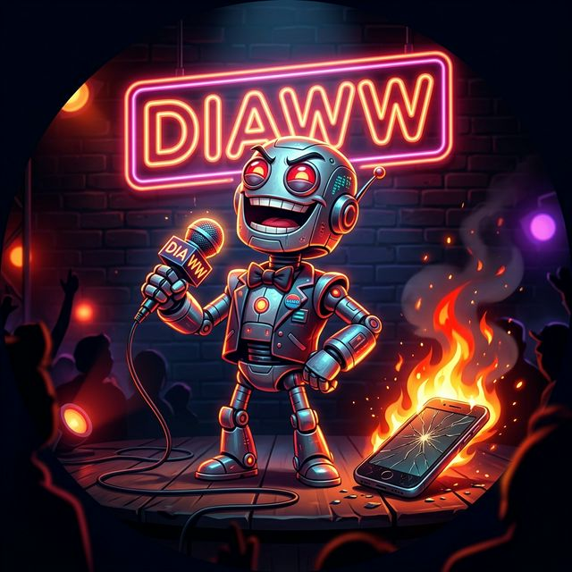

# Roast My Phone 🔥 — AI Brutal Roaster 2026



**Roast My Phone** adalah aplikasi web interaktif beraliran komedi gelap yang dirancang untuk ngeroast spesifikasi handphone kamu menggunakan kecerdasan buatan (Gemini AI). Di setting pada tahun 2026, AI ini bertindak sebagai *stand-up comedian* yang sangat kejam, sarkas, dan tidak segan-segan menghina "sampah elektronik" milikmu.

---

## ✨ Fitur Utama

- **🎨 Premium Glassmorphism UI**: Antarmuka modern dengan efek kaca transparan, blur, dan *glow* yang memanjakan mata.
- **🚀 Dynamic Background**: Efek *moving orbs* dan gradasi radial yang membuat suasana terasa hidup.
- **🤖 Brutal AI Roaster**: Menggunakan model **Gemini 2.5 Flash** (versi terbaru di prompt) untuk memberikan respon roasting paling pedas, menggunakan bahasa gaul Gen Z / Jaksel 2026.
- **⚡ Custom AI Loading**: Animasi "AI Core" yang unik saat mesin sedang meracik kata-kata pedas untukmu.
- **🔒 API Security**: Implementasi pemisahan API Key menggunakan sistem `env.js` (lokal) yang terproteksi dari Github Public.
- **📱 Responsive & Animated**: Berjalan mulus di desktop maupun HP, lengkap dengan animasi *staggered entry*.

---

## 🛠️ Stack Teknologi

- **Frontend**: HTML5, Vanilla JavaScript.
- **Styling**: [Tailwind CSS v4](https://tailwindcss.com/) (Browser-based execution).
- **AI Engine**: [Google Gemini Pro API](https://ai.google.dev/).
- **Fonts**: [Outfit](https://fonts.google.com/specimen/Outfit) via Google Fonts.
- **Visuals**: AI-Generated 3D Cartoon Assets & CSS-based Glassmorphism.

---

## 🚀 Cara Menjalankan

### 1. Kloning Project
```bash
git clone https://github.com/diaz1414/roasting-hp.git
cd roasting-hp
```

### 2. Setup API Key
Agar aplikasi bisa bekerja, kamu butuh API Key dari [Google AI Studio](https://aistudio.google.com/).
1. Buat file baru bernama `env.js` di root folder.
2. Masukkan kode berikut ke dalam `env.js`:
   ```javascript
   const API_KEY = "MASUKKAN_API_KEY_KAMU_DISINI";
   ```
3. Simpan. File ini sudah otomatis terdaftar di `.gitignore` agar tidak bocor ke internet.

### 3. Buka di Browser
Cukup buka file `index.html` langsung di browser favoritmu atau gunakan ekstensi **Live Server** di VS Code.

---

## ⚠️ Peringatan
Respon yang dihasilkan oleh AI bersifat komedi dan bertujuan untuk hiburan semata. Harap tidak baper (*don't take it personally*) jika HP kesayanganmu dihina setara dengan ganjalan pintu atau rongsokan laut.

---

## 👨‍💻 Developed By
**diaww.dev** 
- Website: [diaww.my.id](https://diaww.my.id)
- Powered by Google Gemini AI

Copyright © 2026 - **Roast My Phone**
